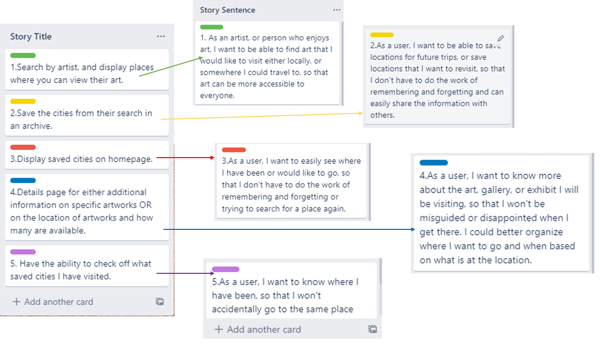
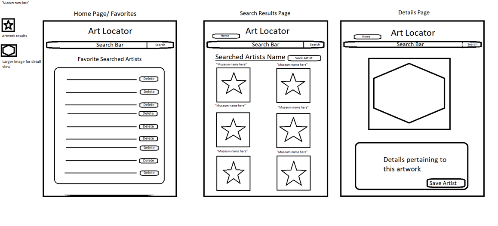
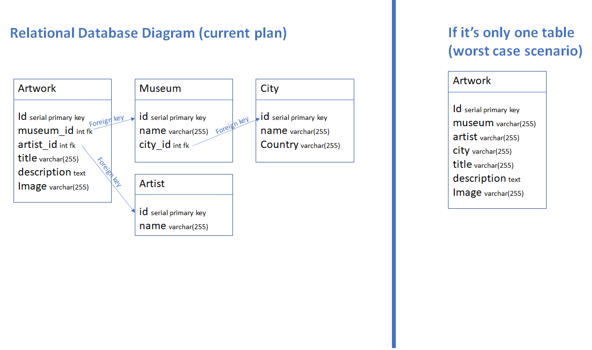
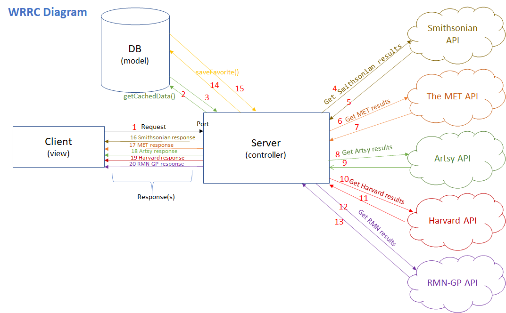
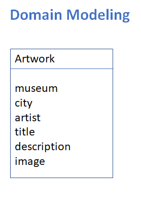

# Welcome to the Art Locator Project

## Project Contributers

Ashley Moore, Austin Smith, Dina Ayoub

## Description

This project aims to allow art lovers to find the next city or museum they may want to visit based on where some of their favorite artists' works are exhibited.

To do this, it connects to multiple APIs from museums around the world to let the user search by artist and add results to their favorites, which will be sorted by city, in descending order of number of artworks available in that city's museums from their favorite artists.

## Our Trello Board

[Art Locator Trello Board](https://trello.com/b/V0owyVX9/art-locator-app)

## APIs used

* [Smithsonian API](http://edan.si.edu/openaccess/apidocs/) - one call to get the artworks for an artist
* [Metropolitan Museum of Art API](https://metmuseum.github.io/) - one call to get the list of artworks, then one call for each of the artworks
* [Artsy API](https://developers.artsy.net/v2) - one call to get the artist ID, then one call to get their artworks
* [Harvard Art Museums API](https://github.com/harvardartmuseums/api-docs) one call to get the artist ID, then one call to get their artworks

## Required node modules

* express
* superagent
* pg
* dotenv

## User Stories

## Mockups

## Relational Database

## WRRC Diagram

## Domain Modeling

## Deployement

[Heroku deployment link: https://art-locator.herokuapp.com/](https://art-locator.herokuapp.com/)