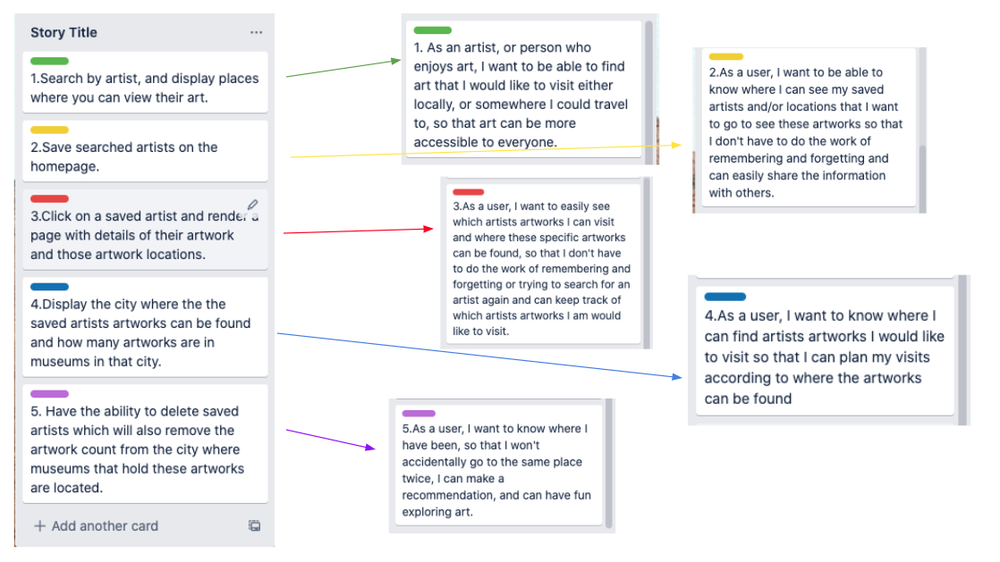

# Welcome to the Art Locator Project

## Project Contributers

Ashley Moore, Austin Smith, Dina Ayoub

## Description

This project aims to allow art lovers to find the next city or museum they may want to visit based on where some of their favorite artists' works are exhibited.

To do this, it connects to multiple APIs from museums around the world to let the user search by artist and add results to their favorites, which will be sorted by city, in descending order of number of artworks available in that city's museums from their favorite artists.

## User Stories

## Mockups

## Relational Database

## WRRC Diagram

## Domain Modeling

## APIs

* [Smithsonian API](http://edan.si.edu/openaccess/apidocs/)
* [Metropolitan Museum of Art API](https://metmuseum.github.io/)
* [Artsy API](https://developers.artsy.net/v2)

Other APIs we may integrate:
* [Harvard Art Museums API] (https://github.com/harvardartmuseums/api-docs)

## Deployement

[Heroku deployment link: https://art-locator.herokuapp.com/](https://art-locator.herokuapp.com/)